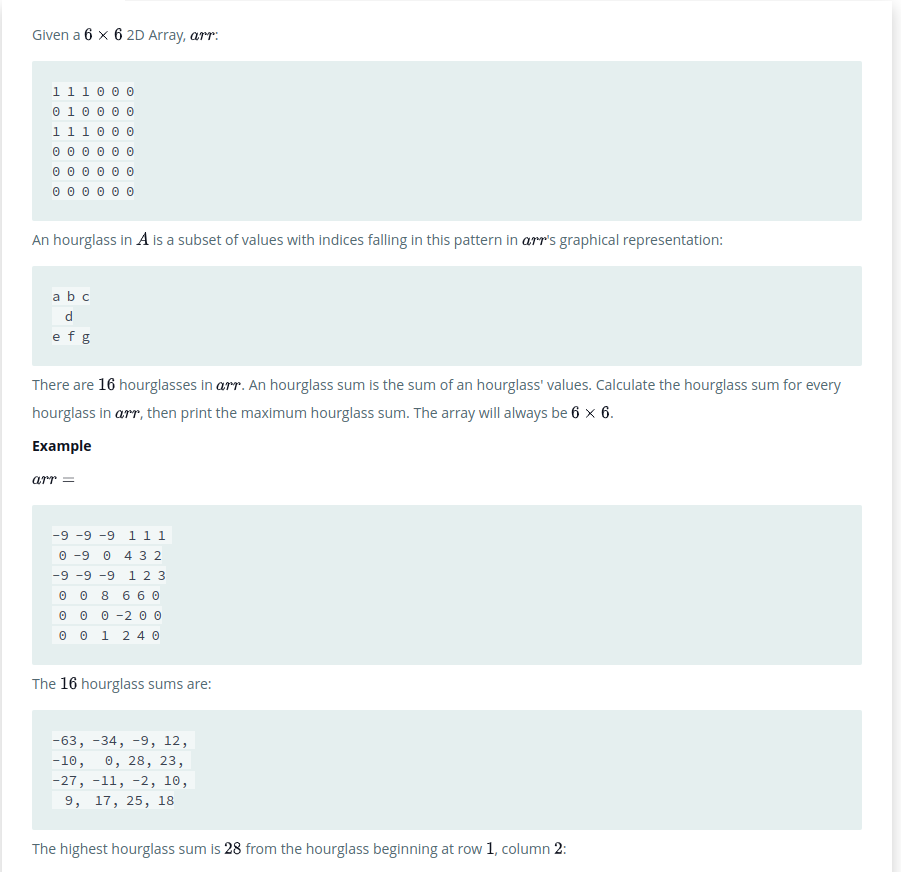
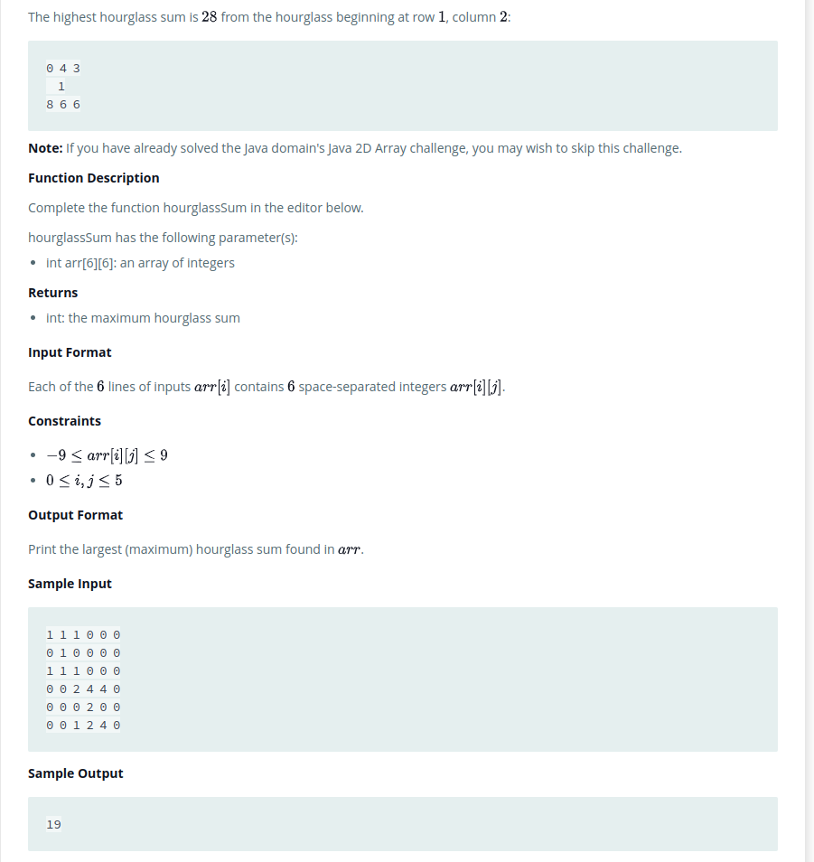
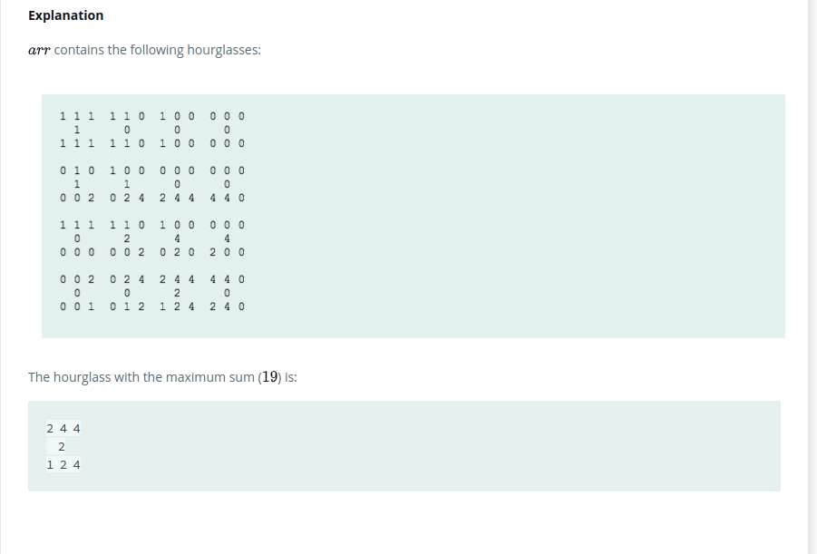
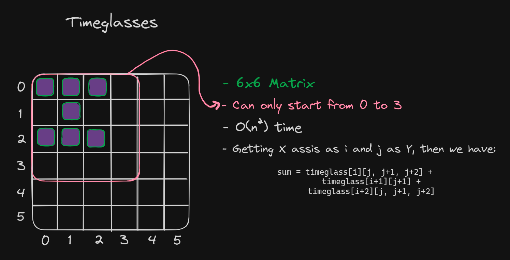

# Problem
link: [2D Array - DS](https://www.hackerrank.com/challenges/2d-array/problem)

# Solution

First of all, I tried to solve this problem without any help/knowledge of some algorithm, I tried to solve it by myself.  
My first try is in the file `tries/try-01.py` and after searching some results, I hope it is fine, but it could be written with less code.  
Then, I refactored the code and reduced the O space complexity from O(n) to O(1) in the file `tries/try-02.py`. Technically, I could call "n" of "n-3" or just "3" because the matrix is always 6x6, but I will call it as "n" n way (so funny bro).  
About the time complexity, I hope there is no way to reduce it from O(n^2).
