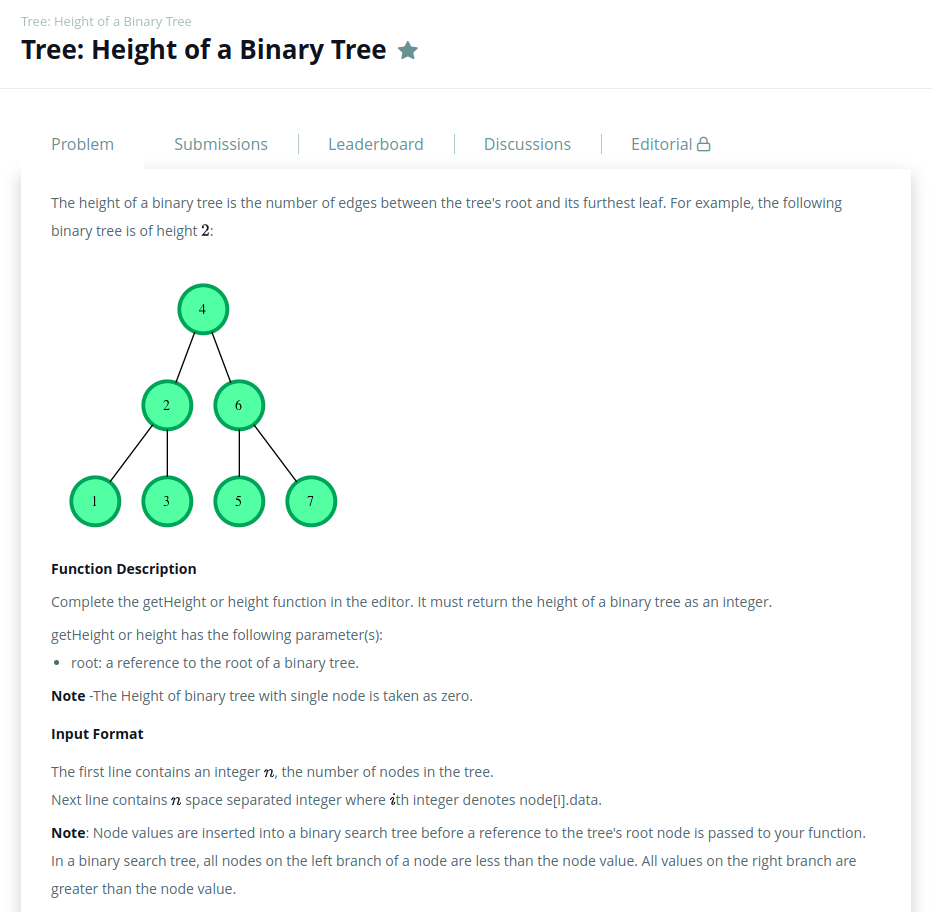
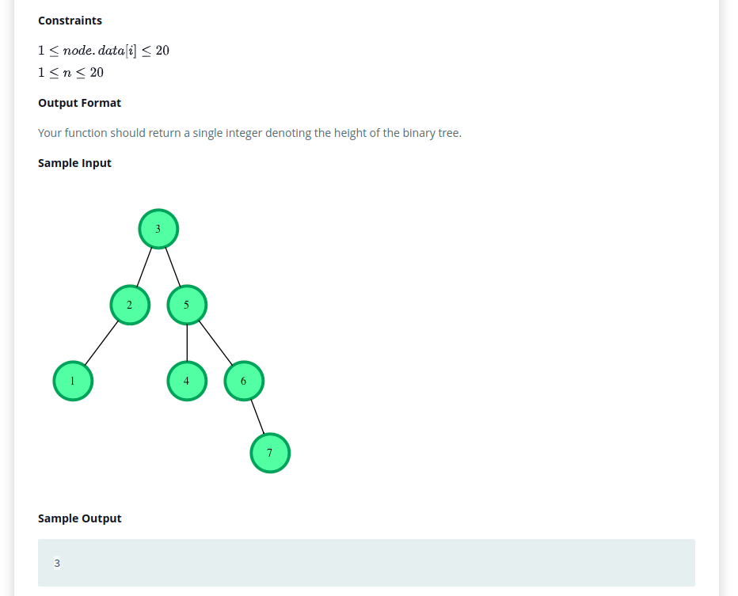
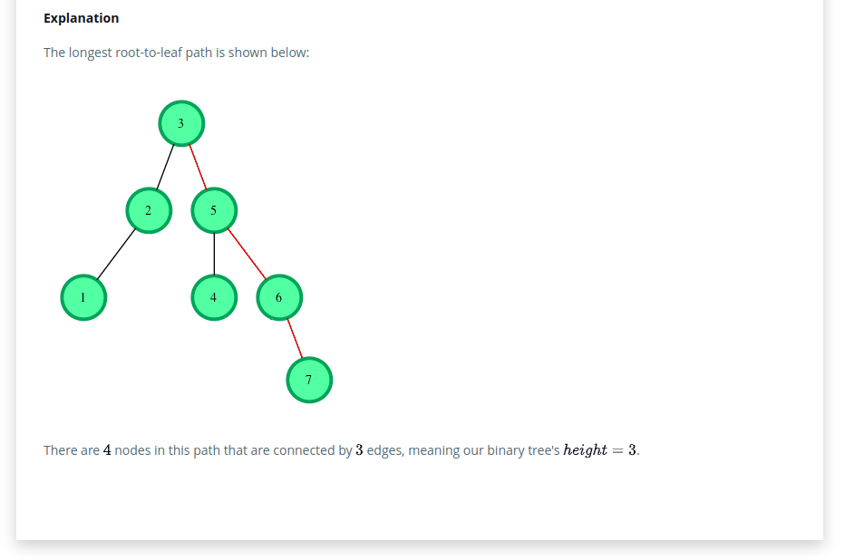
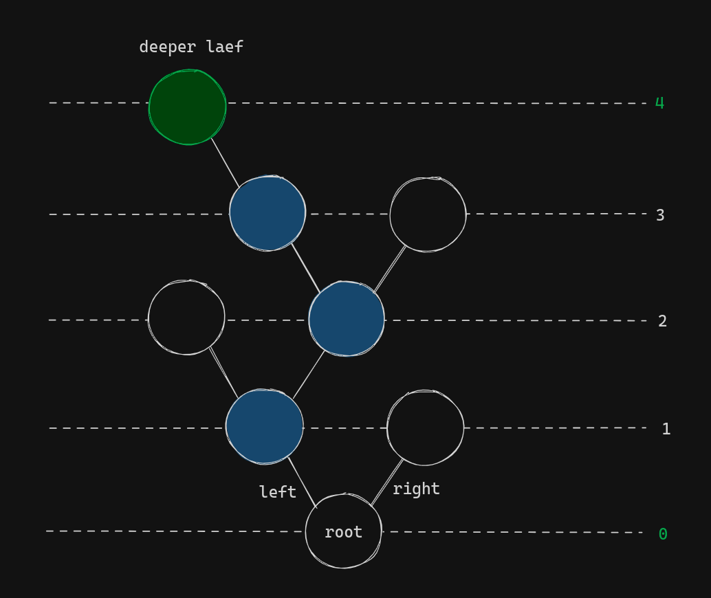

# Problem
link: [binary-tree-height](https://www.hackerrank.com/challenges/three-month-preparation-kit-tree-height-of-a-binary-tree/problem)

# Solution

First of all, I took a look about binary trees and how it works. After that, I tried couple of times do it by my self, but unfortunately I couldnt did it, so, I watched some videos and got the solution by <a href="https://www.youtube.com/@LucasMontano">Lucas Montano</a> witch was written in java, but I got the some hints how to make it work in go. 
My first try is in the file `tries/try-01.go` and after searching some results, I have no idea if it is a good solution, however that was the furthest I could.  
I am not able to say about O complexity space or time, no clue. 
